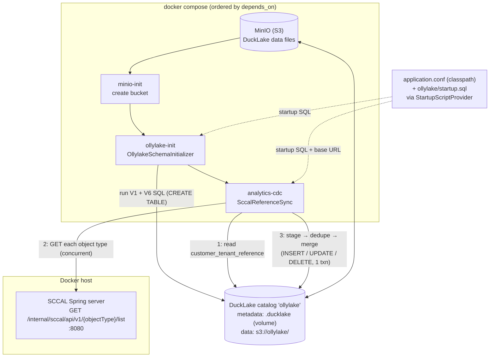

# analytics-cdc

Builds and populates the **analytics reference (dimension) tables** for the
Ollylake data lake. Two small Java programs run on top of a
[DuckLake](https://ducklake.select) catalog whose data files live in MinIO (S3)
and whose metadata lives in a persisted `.ducklake` file:

| Program | Container | Role |
|---|---|---|
| `ai.sentrinox.OllylakeSchemaInitializer` | `ollylake-init` | ATTACH the catalog and run the init SQL (`ollylake/init/*.sql`) to **create** the tables. |
| `ai.sentrinox.SccalReferenceSync` | `analytics-cdc` | Read the `(customerId, tenantId)` pairs, call the **SCCAL internal-sync API**, and **capture changes** (insert/update/delete) into the reference tables. |

Both share one bootstrap: the startup SQL (extensions + S3 secret + `ATTACH`)
is loaded from config via `io.dazzleduck.sql.common.StartupScriptProvider`.

---

## Data flow

**Simplest view** — the three hops, end to end:

```
┌──────────────────┐      ① read (customerId, tenantId) pairs
│  SCCAL Spring    │◄──────────────────────────────┐
│  server  :8080   │                                │
│  (source of      │      ② GET /…/{objectType}/list│
│   truth)         │─── JSON snapshot ──┐           │
└──────────────────┘                    ▼           │
                                ┌─────────────────────┐
                                │  SccalReferenceSync  │
                                │  (analytics-cdc)     │
                                │                      │
                                │  parse JSON          │
                                │  → TEMP staging      │
                                │  → dedupe by key     │
                                │  → INSERT/UPDATE/    │
                                │    DELETE (1 txn)    │
                                └──────────┬───────────┘
                                           │ ③ capture changes
                                           ▼
                          ┌──────────────────────────────┐
                          │  DuckLake catalog 'ollylake'  │
                          │                                │
                          │  metadata → .ducklake file     │
                          │  data     → Parquet in MinIO   │
                          │             (s3://ollylake/)   │
                          └────────────────────────────────┘
```

In one sentence: the SCCAL server is the source of truth → `SccalReferenceSync`
pulls each full JSON snapshot over HTTP → diffs it against the DuckLake reference
tables → writes inserts/updates/deletes as Parquet in MinIO, tracked by the
`.ducklake` metadata file.

**At a glance** — where the data comes from and where it lands:

```
SCCAL Spring server          SccalReferenceSync             DuckLake catalog 'ollylake'        MinIO (S3)
GET /…/{objectType}/list  ──►  fetch → parse JSON      ──►   reference tables           ──►    Parquet data files
  (JSON snapshot)               stage → INSERT/UPDATE/DELETE  (metadata → .ducklake)            s3://ollylake/
```

So the SCCAL server is the source of truth; this job pulls each snapshot over
HTTP, captures the changes into the DuckLake reference tables, and DuckLake
writes the actual column data as Parquet files into MinIO (the `.ducklake`
metadata file just tracks which files belong to which snapshot).



### Inside `SccalReferenceSync` (one run)

```
read (customerId, tenantId) pairs  ──►  customer_tenant_reference  (V1 table)
        │
        ├─ global object types  (providercatalogue …) ── fetched ONCE
        └─ tenant object types  ── fetched concurrently per pair  ──►  SCCAL API
        │
        ▼
   raw JSON map  ──►  bound as ?::JSON  ──►  DuckDB json_extract('$.*')  (no JSON lib)
        │
        ▼
   per-table TEMP staging  ──►  de-dupe by key (QUALIFY row_number)
        │
        ▼
   ┌─ one transaction (atomic DuckLake snapshot) ──────────────┐
   │  DELETE rows absent from snapshot / isDeleted:true        │
   │  UPDATE rows whose attributes changed                     │
   │  INSERT rows new to the table                             │
   └───────────────────────────────────────────────────────────┘
        │
        ▼
   V6 reference tables  (data → MinIO, metadata → catalog)
```

The API is queried **without `commitId`**, so every response is a full snapshot
and "absent from snapshot" is a safe delete signal. The job is **idempotent** —
re-running with unchanged data captures nothing.

---

## Object type → reference table mapping

| V6 table | SCCAL object type | Key | Notes |
|---|---|---|---|
| `workspace` | `workspace` | `workspaceId` | |
| `"user"` | `user` | `userId` | name = `userName` (login email) |
| `"group"` | `usergroup` | `userGroupId` | |
| `user_group_mapping` | `usergroupmembership` | `userId, userGroupId` | edge table (no name) |
| `provider` | `providercatalogue` | `type` | small enum (1–8); `provider_id` is `INTEGER` — global type, fetched once |
| `llm_access_rule` | `rule` (`ruleType = 1`) | `ruleId` | provider/LLM rules |
| `mcp_access_rule` | `rule` (`ruleType = 3`) | `ruleId` | MCP rules |

`tenant`, `vkey`, `mcp_server`, `budget_rule` have **no source endpoint** among
the SCCAL object types and are created but left empty.

---

## Configuration

`src/main/resources/application.conf` (HOCON, auto-loaded from the classpath):

```hocon
analytics_cdc {
  sccal_base_url = "http://localhost:8080"   # env SCCAL_BASE_URL overrides
  poll_interval  = 0                         # env POLL_INTERVAL overrides
  startup_script_provider {
    script_location = "ollylake/startup.sql" # env STARTUP_SQL overrides
  }
}
```

`poll_interval` controls how the CDC runs:
- **`0` (default) — one-shot**: capture once and exit.
- **a positive duration** (e.g. `30s`, `5 minutes`) — **poll**: stay alive and
  re-capture on that interval, reusing the warm DuckDB connection. Cycles that
  change nothing are rolled back (no empty snapshot), and a failed cycle (API
  down, transient error) is logged and retried on the next tick rather than
  killing the process.

`ollylake/startup.sql` holds the bootstrap SQL (INSTALL/LOAD `ducklake`+`httpfs`,
`CREATE SECRET`, `ATTACH`, `USE`). It uses `${ENV_VAR}` placeholders resolved by
`StartupScriptProvider` — **all must be set**:
`MINIO_ROOT_USER`, `MINIO_ROOT_PASSWORD`, `S3_ENDPOINT`, `OLLYLAKE_BUCKET`, `CATALOG_PATH`.

---

## Running

> The SCCAL Spring server must already be running on the host at `:8080`. The
> CDC container reaches it via `host.docker.internal:8080` (wired in compose).

```bash
# Build + start the full chain: minio → minio-init → ollylake-init → analytics-cdc
docker compose up --build

# Re-run only the CDC capture later (e.g. after upstream changes)
docker compose up analytics-cdc

# Run the CDC as a continuous poller instead of one-shot (every 30s)
POLL_INTERVAL=30s docker compose up analytics-cdc

# Logs (prints an ins / upd / del count per table)
docker compose logs -f analytics-cdc

# Tear down (add -v to also wipe MinIO + catalog volumes)
docker compose down
```

To point the CDC at a different API host:

```bash
SCCAL_BASE_URL=http://my-host:8080 docker compose up --build analytics-cdc
```

---

## Build

```bash
mvn -B -DskipTests package      # produces target/analytics-cdc.jar (shaded)
```

The shaded jar's default main class is `OllylakeSchemaInitializer`; the CDC job
runs via `java -cp target/analytics-cdc.jar ai.sentrinox.SccalReferenceSync`.
